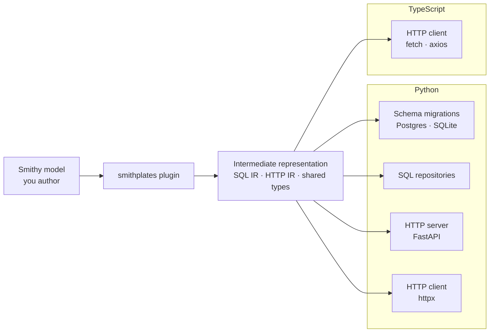

# Smithplates

Pulling the AI Slop Machine lever to non-deterministically generate deterministic code-generators.

This project was inspired by OpenAPI Generator and some of my work at Disney. Outputs are built from smithy specifications, rendered with Scalate SSP templates.

> **Heavy construction.** Smithplates is early and actively evolving. APIs, plugin configuration, generated output, module layout, and documentation are all subject to frequent change — sometimes without a long deprecation window. If you try it today, expect churn: breaking changes, moving docs, and shifting golden-test expectations are normal for now. Pin versions if you experiment, and treat anything outside the documented quick-start paths as provisional.

## Architecture

You author a Smithy model. The `smithplates` plugin extracts an intermediate representation (SQL + HTTP IR), then renders platform-specific artifacts from that IR: schema migrations, SQL repositories, HTTP servers, and HTTP clients.

<!-- architecture-pipeline.mmd:start -->

<!-- architecture-pipeline.mmd:end -->

See [contributing architecture](docs/contributing/architecture.md) for module layout and implementation detail.

## AI Generated

AI Code in production is a recipe for disaster. Deterministically generated code is a huge boon, and this has been
demonstrably true for so long that code generation pipelines continue to be one of the best ways to produce client/server
interactions that are reliable. This project will test how far we can push the AI to generate generators that provide
higher quality output than the AI would output on its own.

## What works today

The `smithplates` plugin (`com.jacoby6000:smithplates-plugin`) is a Smithy build plugin. From a given Smithy specification it emits schema, SQL service, and HTTP service artifacts (see [Architecture](#architecture)):

| Path | Output | Supported today |
|------|--------|-----------------|
| **Schema and migrations** | Dialect-specific DDL (`.sql` migration files) | Postgres, SQLite |
| **SQL database service codegen** | Query models, repository interfaces, dialect-specific implementations, migration runners, and derived-query integration tests | Python |
| **HTTP service codegen** | FastAPI route modules, service protocols, app wiring, WebSocket routes (`@websocket`), response helpers, and problem+json errors | Python |
| **HTTP client codegen** | Route-group clients, registries, operation bindings, WebSocket clients | Python (httpx); TypeScript (axios or fetch) |

**New consumer?** Start with [Getting started](docs/usage/getting-started.md).

WebSockets: annotate an `@httpService` operation with `@websocket` (plus `@http` URI and `@tags`). See [HTTP plugin — WebSockets](docs/usage/http-plugin.md#websockets).


All generated output is intended to be stand-alone and separate from your production code.  The Database Access Layer
generates an interface and automatically implements any derived queries, allowing you to provide your own alternative
implementations without overwriting any generated outputs.  These tools never output stubs that must be overwritten

## Where it is headed

- **Broader language coverage** — TypeScript HTTP clients ship today; SQL and HTTP *server* templates beyond Python, and additional client libraries, are still roadmap work
- **More database backends and access patterns** (sync/async drivers, connection pooling conventions, alternate placeholder styles)
- **Diff-based incremental migrations** beyond the current generated initial schema files and runtime migration runners
- **Custom language templates** — non-bundled languages can ship their own `templateDirectory` + `outputs.json` deck; contribute useful bundles upstream when you can


## Documentation

| Audience | Index |
|----------|-------|
| **Users** (consume plugins in your Smithy project) | [`docs/usage/`](docs/usage/) |
| **Contributors** (develop Smithplates) | [`docs/contributing/`](docs/contributing/) |

**Usage:** [Getting started](docs/usage/getting-started.md) · [Configuration](docs/usage/configuration.md) · [SQL plugin](docs/usage/sql-plugin.md) · [HTTP plugin](docs/usage/http-plugin.md) · [Custom templates](docs/usage/custom-templates.md) · [Examples](docs/usage/examples.md) · [Limitations](docs/usage/limitations.md) · [Changelog](CHANGELOG.md)

**Contributing:** [CONTRIBUTING.md](CONTRIBUTING.md) · [Getting started](docs/contributing/getting-started.md) · [Architecture](docs/contributing/architecture.md) · [Testing](docs/contributing/testing.md) · [Template authoring](docs/contributing/template-authoring.md)

**Release history:** [`CHANGELOG.md`](CHANGELOG.md) (notable changes since v0.2.5, including the v0.3.0 migration notes)

Conventions: [`AGENTS.md`](AGENTS.md) and [`.cursor/rules/`](.cursor/rules/)

## Quick start

Requires [sbtn](https://www.scala-sbt.org/) on `PATH` (`coursier install sbtn`) and **JDK 17**.

```bash
./validate                 # lint + test (preferred)
sbtn publishM2             # local Maven install for consumer smithy build
sbtn smithplatesPlugin/test
```

TypeScript HTTP client example: [`example/typescript/`](example/typescript/) (`./validate --target examples/typescript`).

Pre-commit hooks (optional; `pre-commit install`):

```bash
pre-commit run --all-files
```

Runs `scalafmtAll`, `scalafixAll`, and `compile` on staged Scala/SBT changes, and checks reusable documentation components when applicable. See [Getting started](docs/contributing/getting-started.md#pre-commit-hooks).

Lint and format (also run in [CI](.github/workflows/ci.yml)):

```bash
sbtn scalafmtCheckAll
sbtn 'scalafixAll --check'
```

Docker-backed dialect tests:

```bash
sbtn smithplatesSqlDdlRendererPostgresIt/test
sbtn smithplatesSqlDdlRendererSqliteIt/test
```
