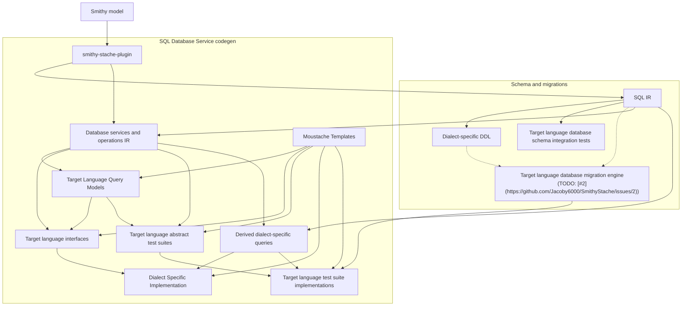

# SmithyStache

Pulling the AI Slop Machine lever to non-deterministicly generate deterministic code-generators. 

This project was inspired by OpenAPI Generator and some of my work at Disney. Outputs are built from smithy specifications, rendered with Mustache templates.

## Architecture

The `smithy-stache` plugin extracts **SQL IR** from the Smithy model, then fans out into **schema and migrations** artifacts and **SQL database service codegen**. SQL database service codegen combines **database services and operations IR** (from `@sqlService` contracts plus SQL IR) with **Mustache templates** to produce target-language query models, interfaces, dialect-specific implementations, and test suites.

<!-- architecture-pipeline.mmd:start -->

<!-- architecture-pipeline.mmd:end -->

See [contributing architecture](docs/contributing/architecture.md) for module layout and implementation detail.

## AI Generated

AI Code in production is a recipe for disaster. Deterministically generated code is a huge boon, and this has been
demonstrably true for so long that code generation pipelines continue to be one of the best ways to produce client/server
interactions that are reliable. This project will test how far we can push the AI to generate generators that provide
higher quality output than the AI would output on its own.

## What works today

The `smithy-stache` plugin (`com.jacoby6000:smithy-stache-plugin`) is a Smithy build plugin. From a given Smithy specification it emits artifacts along two paths (see [Architecture](#architecture)):

| Path | Output | Supported today | Mechanism |
|------|--------|-----------------|-----------|
| **Schema and migrations** | Dialect-specific DDL (`.sql` migration files) | Postgres, SQLite | SQL IR → dialect renderers |
| **Schema and migrations** | Derived DML in DDL `-- Queries` section | Postgres, SQLite | SQL IR → dialect renderers; basic SELECT/INSERT/UPDATE/DELETE from derive traits |
| **Schema and migrations** | Schema integration tests | Contributor modules | SQL IR → DDL applied to real databases (testcontainers) |
| **Schema and migrations** | Per-language migration engines | — | Planned ([#2](https://github.com/Jacoby6000/SmithyStache/issues/2)) |
| **SQL database service codegen** | Target-language query models, repository interfaces, dialect-specific implementations | Python | Service IR + SQL IR + SSP templates under [`templates/`](templates/) |
| **SQL database service codegen** | Derived-query integration tests | Python (SQLite in-memory; Postgres via testcontainers) | Derived queries + abstract test suites + Mustache templates (migration engine planned ([#2](https://github.com/Jacoby6000/SmithyStache/issues/2))) |


All generated output is intended to be stand-alone and separate from your production code.  The Database Access Layer
generates an interface and automatically implements any derived queries, allowing you to provide your own alternative
implementations without overwriting any generated outputs.  These tools never output stubs that must be overwritten

## Where it is headed

- **HTTP / Smithy Spec aligned service stubs** and server integrations
- **Additional languages** beyond Python (each with its own `languageTargets` entry and template bundle)
- **More database backends and access patterns** (sync/async drivers, connection pooling conventions, alternate placeholder styles)
- **Support for unsupported languages** even if this tool does not support your language, you can define your own templates to add your own support.  Contribute it back to our repo if you do!


## Documentation

| Audience | Index |
|----------|-------|
| **Users** (consume plugins in your Smithy project) | [`docs/usage/`](docs/usage/) |
| **Contributors** (develop SmithyStache) | [`docs/contributing/`](docs/contributing/) |

**Usage:** [Integration](docs/usage/integration.md) · [SQL plugin](docs/usage/sql-plugin.md)

**Contributing:** [Getting started](docs/contributing/getting-started.md) · [Architecture](docs/contributing/architecture.md) · [Integration tests](docs/contributing/integration-tests.md)

Conventions: [`AGENTS.md`](AGENTS.md)

## Quick start

Requires [sbtn](https://www.scala-sbt.org/) on `PATH` (`coursier install sbtn`).

```bash
sbtn publishM2
sbtn smithyStachePlugin/test
```

Pre-commit hooks (optional; `pre-commit install`):

```bash
pre-commit run --all-files
```

Runs `scalafmtAll`, `scalafixAll`, and `compile` before each commit. See [Getting started](docs/contributing/getting-started.md#pre-commit-hooks).

Lint and format (also run in [CI](.github/workflows/ci.yml)):

```bash
sbtn scalafmtCheckAll
sbtn 'scalafixAll --check'
```

Docker-backed dialect tests:

```bash
sbtn smithySqlPostgresRendererIt/test
sbtn smithySqlSqliteRendererIt/test
```
