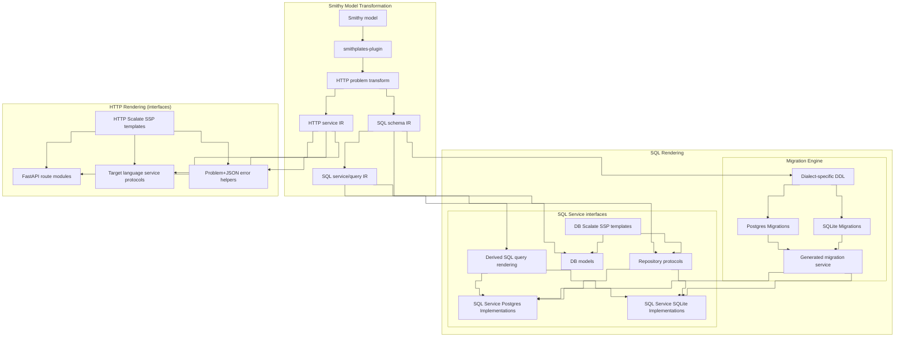

# Smithplates

Pulling the AI Slop Machine lever to non-deterministically generate deterministic code-generators.

This project was inspired by OpenAPI Generator and some of my work at Disney. Outputs are built from smithy specifications, rendered with Scalate SSP templates.

## Architecture

The `smithplates` plugin extracts SQL and HTTP IR from the Smithy model, then fans out into schema migrations, SQL database service codegen, and HTTP service codegen. SQL database service codegen combines `@sqlService` contracts with SQL IR and Scalate SSP templates to produce target-language query models, interfaces, dialect-specific implementations, migration runners, and test suites. HTTP service codegen uses `@httpService` contracts and bundled FastAPI templates to produce route modules, service protocols, app wiring, and problem+json helpers.

<!-- architecture-pipeline.mmd:start -->

<!-- architecture-pipeline.mmd:end -->

See [contributing architecture](docs/contributing/architecture.md) for module layout and implementation detail.

## AI Generated

AI Code in production is a recipe for disaster. Deterministically generated code is a huge boon, and this has been
demonstrably true for so long that code generation pipelines continue to be one of the best ways to produce client/server
interactions that are reliable. This project will test how far we can push the AI to generate generators that provide
higher quality output than the AI would output on its own.

## What works today

The `smithplates` plugin (`com.jacoby6000:smithplates-plugin`) is a Smithy build plugin. From a given Smithy specification it emits schema, SQL service, and HTTP service artifacts (see [Architecture](#architecture)):

| Path | Output | Supported today | Mechanism |
|------|--------|-----------------|-----------|
| **Schema and migrations** | Dialect-specific DDL (`.sql` migration files) | Postgres, SQLite | SQL IR → dialect renderers |
| **Schema and migrations** | Schema integration tests | Contributor modules | SQL IR → DDL applied to real databases (testcontainers) |
| **SQL database service codegen** | Target-language query models, repository interfaces, dialect-specific implementations, and migration runners | Python | Service IR + SQL IR + SSP templates under [`templates/`](templates/) |
| **SQL database service codegen** | Derived-query integration tests | Python (SQLite in-memory; Postgres via testcontainers) | Derived queries + generated migration runners + SSP templates |
| **HTTP service codegen** | FastAPI route modules, service protocols, app wiring, response helpers, and problem+json errors | Python | HTTP IR + SSP templates under [`templates/`](templates/) |


All generated output is intended to be stand-alone and separate from your production code.  The Database Access Layer
generates an interface and automatically implements any derived queries, allowing you to provide your own alternative
implementations without overwriting any generated outputs.  These tools never output stubs that must be overwritten

## Where it is headed

- **Additional languages** beyond Python (each with its own `languageTargets` entry and template bundle)
- **More database backends and access patterns** (sync/async drivers, connection pooling conventions, alternate placeholder styles)
- **Diff-based incremental migrations** beyond the current generated initial schema files and runtime migration runners
- **Support for unsupported languages** even if this tool does not support your language, you can define your own templates to add your own support.  Contribute it back to our repo if you do!


## Documentation

| Audience | Index |
|----------|-------|
| **Users** (consume plugins in your Smithy project) | [`docs/usage/`](docs/usage/) |
| **Contributors** (develop Smithplates) | [`docs/contributing/`](docs/contributing/) |

**Usage:** [Getting started](docs/usage/getting-started.md) · [Configuration](docs/usage/configuration.md) · [SQL plugin](docs/usage/sql-plugin.md) · [HTTP plugin](docs/usage/http-plugin.md) · [Examples](docs/usage/examples.md)

**Contributing:** [CONTRIBUTING.md](CONTRIBUTING.md) · [Getting started](docs/contributing/getting-started.md) · [Architecture](docs/contributing/architecture.md) · [Testing](docs/contributing/testing.md) · [Template authoring](docs/contributing/template-authoring.md)

Conventions: [`AGENTS.md`](AGENTS.md)

## Quick start

Requires [sbtn](https://www.scala-sbt.org/) on `PATH` (`coursier install sbtn`).

```bash
sbtn publishM2
sbtn smithplatesPlugin/test
```

Pre-commit hooks (optional; `pre-commit install`):

```bash
pre-commit run --all-files
```

Runs `scalafmtAll`, `scalafixAll`, and `compile` on staged Scala/SBT changes, and checks reusable documentation components when applicable. See [Getting started](docs/contributing/getting-started.md#pre-commit-hooks).

Lint and format (also run in [CI](.github/workflows/ci.yml)):

```bash
sbtn scalafmtCheckAll
sbtn 'scalafixAll --check'
```

Docker-backed dialect tests:

```bash
sbtn smithplatesSqlDdlRendererPostgresIt/test
sbtn smithplatesSqlDdlRendererSqliteIt/test
```
