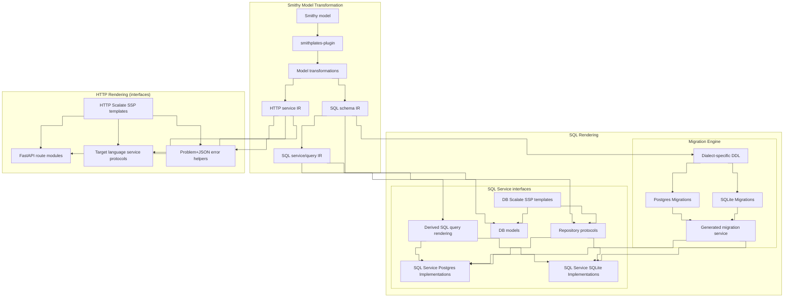

# Architecture

Smithplates is an SBT multi-module project (**Scala 3.3.6**, strict compiler options) that publishes Smithy build plugins to Maven.

## Codegen pipeline

The Mermaid diagram below is generated from [`docs/reusable-components/architecture-pipeline.mmd`](../reusable-components/architecture-pipeline.mmd). Edit that component, then run `scripts/sync_reusable_components.py` to refresh embedded copies in this document and the repository [`README.md`](../../README.md).

The [`smithplates`](../../modules/smithplates-plugin/) plugin extracts **SQL IR** via [`SqlIrExtractor`](../../modules/smithplates-sql-ir/src/main/scala/com/jacoby6000/smithplates/sql/SqlIrExtractor.scala) into [`SqlSchema`](../../modules/smithplates-sql-ir/src/main/scala/com/jacoby6000/smithplates/sql/model/SqlSchemaModel.scala) (tables and relationships), then **service IR** via [`SqlServiceIrExtractor`](../../modules/smithplates-sql-service-ir/src/main/scala/com/jacoby6000/smithplates/sql/service/SqlServiceIrExtractor.scala) into [`SqlServiceIr`](../../modules/smithplates-sql-service-ir/src/main/scala/com/jacoby6000/smithplates/sql/service/SqlServiceIrModel.scala) (derived queries and `@sqlService` operations). It also extracts **HTTP service IR** from `@httpService` models. SQL IR feeds the **schema and migrations** path directly. SQL and HTTP service codegen render target-language artifacts with Scalate SSP templates.

<!-- architecture-pipeline.mmd:start -->

<!-- architecture-pipeline.mmd:end -->

### Pipeline stages

| Stage | Role today | Primary code / config |
|-------|------------|------------------------|
| Smithy model | Consumer or test Smithy IDL | `PluginContext.getModel` |
| `smithplates` plugin | Orchestrates extraction and rendering | [`SmithplatesBuildPlugin`](../../modules/smithplates-plugin/src/main/scala/com/jacoby6000/smithplates/plugin/SmithplatesBuildPlugin.scala) |
| SQL IR | `@sqlTable` structures and FK relationships | [`SqlIrExtractor`](../../modules/smithplates-sql-ir/src/main/scala/com/jacoby6000/smithplates/sql/SqlIrExtractor.scala) |
| Database services and operations IR | Derived DML query specs and `@sqlService` operation contracts | [`SqlQueryExtractor`](../../modules/smithplates-sql-service-ir/src/main/scala/com/jacoby6000/smithplates/sql/service/SqlQueryExtractor.scala), [`SqlServiceExtractor`](../../modules/smithplates-sql-service-ir/src/main/scala/com/jacoby6000/smithplates/sql/service/SqlServiceExtractor.scala); `SqlServiceIr` |
| HTTP service IR | `@httpService` service contracts, route grouping, response bindings, and problem details | `smithplates-http-ir`; HTTP traits and transforms |
| SSP templates | Language- and dialect-specific codegen templates | `smithplates.<language>.sql.templateDirectory` / `smithplates.<language>.http.server.templateDirectory`; bundled sources under [`templates/`](../../templates/) |
| Target Language Query Models | Dataclass (or equivalent) types for service input, output, error, and query shapes | [`SqlServiceCodegenRenderer`](../../modules/smithplates-sql-service-renderer/src/main/scala/com/jacoby6000/smithplates/sql/service/renderer/SqlServiceCodegenRenderer.scala); `models.ssp` |
| Dialect-specific DDL | `CREATE TABLE`, indexes, enums in versioned migration files | [`SqlSchemaDdlRenderer`](../../modules/smithplates-sql-ddl-renderer-common/src/main/scala/com/jacoby6000/smithplates/sql/ddl/renderer/common/SqlSchemaDdlRenderer.scala) per dialect; [`DialectRenderers.renderDdlOnly`](../../modules/smithplates-plugin/src/main/scala/com/jacoby6000/smithplates/plugin/DialectRenderers.scala) in the plugin; `smithplates.<language>.sql.<dialect>.migrationLocation` (directory) |
| Schema integration tests | Apply generated DDL to real databases | [`smithplates-sql-ddl-renderer-postgres-it`](../../modules/smithplates-sql-ddl-renderer-postgres-it/), [`smithplates-sql-ddl-renderer-sqlite-it`](../../modules/smithplates-sql-ddl-renderer-sqlite-it/) |
| Migration engine | Per-language migration runner: applies versioned `.sql` files one at a time, records version + schema hash in `_smithplates_migrations`; hash is computed from live database catalog metadata after each migration and validated before applying pending migrations | Bundled Python `sqlite_migrations.py` / `psycopg_migrations.py`; `migrations_service.ssp` |
| Target language interfaces | Repository `Protocol` per `@sqlService` | `service_protocol.ssp`; service IR + query models + templates |
| Derived dialect-specific queries | INSERT, UPDATE, DELETE, and SELECT rendered per dialect from service IR, bound to service operations | `SqlServiceIr.queries`; service IR + SQL IR |
| Dialect-specific implementations | Driver-specific `@sqlService` implementations | `service_aiosqlite.ssp`, `service_psycopg.ssp`; interfaces + derived queries + templates |
| Test suite implementations | Pytest lifecycle tests for derived CRUD operations | `service_derived_sql_integration_tests*.ssp`; derived queries + templates + generated migration services |
| HTTP service artifacts | FastAPI route modules, service protocols, app wiring, response helpers, and problem+json exceptions | `smithplates-http-service-renderer`; bundled `templates/python/src/http/` |

Consumer configuration is documented in [Integration](../usage/integration.md): each language entry controls SQL and HTTP codegen, enabled dialects control DDL export and driver templates, and output directories stay explicit.

Generated filesystem paths and default Python import packages are derived from Smithy shape namespaces via [`CodegenPackageNames`](../../modules/smithplates-scalate-precompiler/src/main/scala/com/jacoby6000/smithplates/codegen/CodegenPackageNames.scala) and [`SmithyNamespaceMapping`](../../modules/smithplates-scalate-precompiler/src/main/scala/com/jacoby6000/smithplates/codegen/SmithyNamespaceMapping.scala). Template roots (`classpath:python/src/db`, `classpath:python/src/http/server`, …) select which artifact families are rendered; output paths and import packages follow the Smithy namespace plus optional `rootNamespace`, not the template directory layout.

## Module graph

```
modules/smithplates-plugin (published)
    ├── smithplates-sql-ir
    ├── smithplates-sql-ddl-renderer-common
    ├── smithplates-sql-service-ir
    ├── smithplates-sql-ddl-renderer-postgres
    ├── smithplates-sql-ddl-renderer-sqlite
    ├── smithplates-sql-service-query-renderer
    ├── smithplates-sql-service-query-renderer-common
    ├── smithplates-sql-service-query-renderer-postgres
    ├── smithplates-sql-service-query-renderer-sqlite
    ├── smithplates-sql-service-renderer
    ├── smithplates-scalate-precompiler
    ├── smithplates-http-ir
    └── smithplates-http-service-renderer

modules/smithplates-testkit (library, unpublished)
    ├── smithplates-sql-ddl-renderer-postgres-it (test, unpublished)
    └── smithplates-sql-ddl-renderer-sqlite-it (test, unpublished)
```

`smithplates-plugin` is the only artifact consumers reference by coordinate, but its entire transitive compile graph (every module listed above it) is **published** so Maven can resolve those dependencies — and so the renderer jars carrying precompiled SSP template classes reach consumers. The IR jars that publish Smithy trait IDL include `META-INF/smithy/manifest` files so Smithy CLI model discovery loads those resources from Maven dependencies. Only `smithplates-testkit` and the dialect IT modules stay unpublished (`unpublishedModuleSettings`); all others use `publishedModuleSettings`. `sbtn publishM2` publishes the full set.

- **smithplates-sql-ir** — schema ADTs, table extraction; Smithy trait IDL and Java `TraitService` SPI.
- **smithplates-sql-ddl-renderer-common** — shared DDL rendering (`SqlSchemaDdlRenderer`, `SqlShared`).
- **smithplates-sql-service-ir** — query and service IR, extractors.
- **smithplates-sql-service-query-renderer** — `SqlQueryRenderer` trait, `SqlParameterizedStatement`, dialect-neutral query output types.
- **smithplates-sql-service-query-renderer-common** — shared dialect-neutral query rendering (`SqlQueryRendering`).
- **smithplates-sql-service-query-renderer-postgres** / **smithplates-sql-service-query-renderer-sqlite** — dialect `SqlQueryRenderer` implementations.
- **smithplates-sql-ddl-renderer-sqlite** / **smithplates-sql-ddl-renderer-postgres** — dialect schema DDL (`SqlSchemaDdlRenderer`); depend on `smithplates-sql-ddl-renderer-common`; no service-IR dependency.
- **smithplates-sql-service-renderer** — Scalate SSP service codegen; compile depends on query-renderer base only. Its published jar bundles precompiled SSP template classes (see [Template precompilation](#template-precompilation)).
- **smithplates-scalate-precompiler** — shared build/runtime helper that derives the per-template-root Scala `packagePrefix` and ahead-of-time compiles bundled SSP templates to JVM classes. Used by both renderer modules' precompile build tasks and their runtime engines.
- **smithplates-http-ir** / **smithplates-http-service-renderer** — `@httpService` IR extraction and Scalate SSP HTTP codegen; the renderer jar also bundles precompiled SSP template classes.
- **smithplates-plugin** — thin orchestration; the only artifact consumers reference by coordinate (`com.jacoby6000:smithplates-plugin`). Its transitive dependency modules are published alongside it.
- **smithplates-testkit** — shared Smithy fixtures and JDBC DDL helpers in `src/main`.
- **smithplates-sql-ddl-renderer-postgres-it** / **smithplates-sql-ddl-renderer-sqlite-it** — schema-path integration tests via [testcontainers-scala](https://github.com/testcontainers/testcontainers-scala/).

## SQL plugin design

### Validation

Model extraction and plugin settings validation use Cats **`ValidatedNel[SqlSchemaError, *]`** (`SqlValidated`) so errors accumulate across tables and members. [`SmithplatesBuildPlugin`](../../modules/smithplates-plugin/src/main/scala/com/jacoby6000/smithplates/plugin/SmithplatesBuildPlugin.scala) converts invalid results to a single exception at the Smithy build boundary. Do not use `for` on `Validated` (fail-fast); use `mapN` / `traverse`.

### Model extraction

[`SqlIrExtractor`](../../modules/smithplates-sql-ir/src/main/scala/com/jacoby6000/smithplates/sql/SqlIrExtractor.scala) assembles **`SqlSchema`** (tables and relationships) from `@sqlTable` and `@sqlForeignKey` members (many-to-one by default; one-to-one when the FK column also has `@sqlUniqueIndex`). [`SqlServiceIrExtractor`](../../modules/smithplates-sql-service-ir/src/main/scala/com/jacoby6000/smithplates/sql/service/SqlServiceIrExtractor.scala) assembles **`SqlServiceIr`**: [`SqlQueryExtractor`](../../modules/smithplates-sql-service-ir/src/main/scala/com/jacoby6000/smithplates/sql/service/SqlQueryExtractor.scala) fills `queries` from derive traits; [`SqlServiceExtractor`](../../modules/smithplates-sql-service-ir/src/main/scala/com/jacoby6000/smithplates/sql/service/SqlServiceExtractor.scala) validates `@sqlService` operation contracts into `services`. Derived queries bind to service methods by matching operation shape ids on derive traits.

### Rendering

**Schema and migrations:** dialect DDL renderers expose [`DDLStatement`](../../modules/smithplates-sql-ir/src/main/scala/com/jacoby6000/smithplates/sql/model/DDLStatement.scala) values keyed by Smithy shape id. [`SqlTableTree`](../../modules/smithplates-sql-ir/src/main/scala/com/jacoby6000/smithplates/sql/SqlTableTree.scala) models foreign-key edges as a deterministic graph so cyclic table relationships do not recurse during ordering. [`DialectRenderers.renderDdlOnly`](../../modules/smithplates-plugin/src/main/scala/com/jacoby6000/smithplates/plugin/DialectRenderers.scala) writes the exported `.sql` migration file text. Derived service queries are rendered separately by SQL service codegen; derived inserts reject target tables in required foreign-key cycles because they require deferred constraint evaluation.

**SQL database service codegen:** [`SqlServiceCodegenRenderer`](../../modules/smithplates-sql-service-renderer/src/main/scala/com/jacoby6000/smithplates/sql/service/renderer/SqlServiceCodegenRenderer.scala) combines service IR, SQL schema context, injected [`SqlQueryRenderer`](../../modules/smithplates-sql-service-query-renderer/src/main/scala/com/jacoby6000/smithplates/sql/service/query/renderer/SqlQueryRenderer.scala) instances, and Scalate SSP templates into target-language query models, interfaces, dialect-specific implementations, and test suites. Enabled dialect keys select placeholder style and driver templates.

### Package layout

| Package | Responsibility |
|---------|----------------|
| `com.jacoby6000.smithplates.plugin` | `smithplates` build plugin (`SmithplatesBuildPlugin`), settings validation |
| `com.jacoby6000.smithplates.sql` | `SqlValidated`, schema IR extraction, table traits |
| `com.jacoby6000.smithplates.sql.traits` | Schema trait `TraitService` implementations (`smithplates-sql-ir`, SPI-registered) |
| `com.jacoby6000.smithplates.sql.service` | Service/query IR, extractors |
| `com.jacoby6000.smithplates.sql.service.traits` | Query/service trait `TraitService` implementations (`smithplates-sql-service-ir`, SPI-registered) |
| `com.jacoby6000.smithplates.sql.service.query.renderer` | `SqlQueryRenderer`, `SqlParameterizedStatement`, `SqlRenderedQuery`, `SqlQueryRenderOutput` |
| `com.jacoby6000.smithplates.sql.service.query.renderer.common` | `SqlQueryRendering` (dialect-neutral query unit rendering) |
| `com.jacoby6000.smithplates.sql.service.query.renderer.postgres` / `.sqlite` | Dialect `SqlQueryRenderer` implementations |
| `com.jacoby6000.smithplates.sql.ddl.renderer.common` | `SqlSchemaDdlRenderer`, `SqlShared`, DDL rendering (`smithplates-sql-ddl-renderer-common`) |
| `com.jacoby6000.smithplates.sql.ddl.renderer.sqlite` | SQLite column types and `CHECK` constraints |
| `com.jacoby6000.smithplates.sql.ddl.renderer.postgres` | Postgres column types |
| `com.jacoby6000.smithplates.sql.service.codegen` | Resolved operation queries (`SqlOperationQueryResolver`, `smithplates-sql-service-ir`) |
| `com.jacoby6000.smithplates.sql.service.renderer` | Scalate SSP orchestration for `@sqlService` codegen (`smithplates-sql-service-renderer`) |
| `com.jacoby6000.smithplates.sql.service.renderer.codegentest` | Shared golden-template test infrastructure (`smithplates-sql-service-renderer` tests) |
| `com.jacoby6000.smithplates.plugin.codegentest` | Plugin-local golden-template runner helpers (`smithplates-plugin` tests) |

## Template precompilation

Bundled Scalate SSP templates are compiled to JVM classes **at build time** and packaged into the published renderer jars, so consumers' `smithy build` runs load precompiled template classes instead of invoking the Scala compiler on first render. This removes the dominant cold-start cost of codegen for end users.

### How it works

- [`ScalateTemplatePrecompiler`](../../modules/smithplates-scalate-precompiler/src/main/scala/com/jacoby6000/smithplates/scalate/precompiler/ScalateTemplatePrecompiler.scala) derives a deterministic Scala `packagePrefix` per template root (for example `scalate.precompiled.python.src.db`), enumerates `.ssp` files (excluding injected `preamble.ssp` fragments), generates Scala sources for **both** URI conventions Scalate uses at load time (root-relative for top-level templates, root-prefixed for `include`/`render` targets), and batch-compiles them with `dotty.tools.dotc.Main`.
- Each renderer's runtime engine ([`ScalateSspTemplateEngine`](../../modules/smithplates-sql-service-renderer/src/main/scala/com/jacoby6000/smithplates/sql/service/renderer/ScalateSspTemplateEngine.scala)) sets the **same** `packagePrefix`, so the class name Scalate derives at runtime matches the precompiled class on the classpath. With `allowReload=false`, `TemplateEngine.load` finds the precompiled class and skips recompilation. The `packagePrefix` also namespaces template classes per template root, avoiding collisions between `db` and `http` templates that share relative paths (for example `fragments/...`).
- The build wires this through `scalateTemplatePrecompileSettings` in [`build.sbt`](../../build.sbt): a cached `precompiledTemplateClasses` task (keyed on bundled template sources + module class files) runs each module's `*TemplatePrecompilerMain` in a forked JVM on the module classpath and adds the resulting `.class` files to `Compile / packageBin / mappings`. The default compile flow is unchanged; only the packaged jar gains the extra classes.

### Compiler options for generated templates

Both the build-time precompiler and Scalate's runtime fallback compiler use a single shared option set, [`ScalateTemplatePrecompiler.templateScalacOptions`](../../modules/smithplates-scalate-precompiler/src/main/scala/com/jacoby6000/smithplates/scalate/precompiler/ScalateTemplatePrecompiler.scala) (`-no-indent`). The runtime engines obtain it via [`ConfiguredTemplateEngine`](../../modules/smithplates-scalate-precompiler/src/main/scala/com/jacoby6000/smithplates/scalate/precompiler/ConfiguredTemplateEngine.scala), which overrides `TemplateEngine.createCompiler` to return a `ScalaCompiler` subclass that appends these options (Scalate's `ScalaCompiler` otherwise passes only `-classpath`/`-d`).

`-no-indent` mirrors the project's own build flag and is the one strict option meaningful for machine-generated code: Scalate emits its template wrappers and our injected preamble in mixed brace/significant-indentation style, which the Scala 3 optional-braces checker would otherwise flag as "Line is indented too far to the left" on nearly every line. The remaining strict build options (`-Wunused:all`, `-Wvalue-discard`, `-Werror`) are intentionally **not** applied to generated templates — they would turn unavoidable artifacts of generated code (per-template-unused injected helper defs, discarded render-context appends) into thousands of compile errors. Those checks remain enforced on the hand-written renderer sources by the sbt build.

### Tests load precompiled classes

So the codegen golden suites exercise the published behavior (and stay free of Scalate runtime-compiler diagnostics), each renderer's precompiled class directory (`target/scalate-precompiled/classes`) is added to the relevant `Test / unmanagedClasspath` — the renderer modules for their own tests, and the plugin module (where the golden suites live) for both renderers. With the matching `packagePrefix` and `allowReload=false`, `TemplateEngine.load` then resolves the precompiled class from the classpath and skips runtime compilation entirely; if a precompiled class is ever missing it transparently falls back to compiling that template.

### Distribution

Because precompiled classes live in the renderer jars (not the thin plugin jar), the plugin's full transitive dependency graph is published (`publishedModuleSettings`), letting consumers resolve the renderer jars — and their precompiled templates — via the single `smithplates-plugin` coordinate.

## Dependencies

| Library | Version | Used for |
|---------|---------|----------|
| Smithy (`smithy-build`, `smithy-model`, `smithy-utils`) | 1.71.0 | Build plugins and trait model |
| Cats Core | 2.12.0 | `ValidatedNel` validation |
| Cats Effect | 3.7.0 | Declared on `smithplatesPlugin`, `smithplatesTestkit`, dialect IT modules, and root; extraction does not use `IO` |
| Scalate | 1.10.1 | SSP templates under [`templates/`](../../templates/) |

Synchronous extraction does not use `IO`.

## Toolchain

- **sbtn** — always use the SBT thin client from this repository; never plain `sbt` or `coursier launch org.scala-sbt:sbt-launch:…`.
- **Smithy models** — Smithy 2.0 IDL (`$version: "2.0"`).
- **Python language test harness** — [`language-test-harnesses/python/`](../../language-test-harnesses/python/) runs ruff, mypy, and pytest against `templates/python/tests/<case>/expected/` in place; requires `uv` on `PATH` (Docker for postgres variants).
