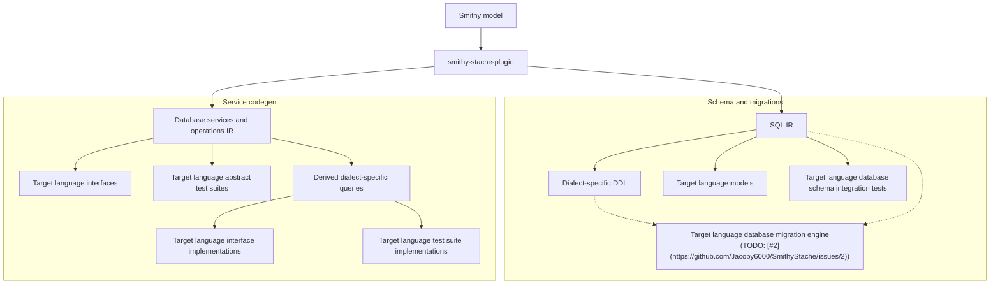

# Architecture

SmithyStache is an SBT multi-module project (**Scala 3.3.6**, strict compiler options) that publishes Smithy build plugins to Maven.

## Codegen pipeline

The Mermaid diagram below is generated from [`docs/reusable-components/architecture-pipeline.mmd`](../reusable-components/architecture-pipeline.mmd). Edit that component, then run `scripts/sync_reusable_components.py` to refresh embedded copies in this document and the repository [`README.md`](../../README.md).

The [`smithy-stache`](../../sql-plugin/) plugin reads a Smithy model and fans out into two artifact paths. [`SqlModelExtractor`](../../sql-plugin/src/main/scala/com/jacoby6000/smithy/stache/sql/SqlModelExtractor.scala) builds a single [`SqlSchema`](../../sql-plugin/src/main/scala/com/jacoby6000/smithy/stache/sql/SqlSchemaModel.scala) containing tables, relationships, derived queries, and `@sqlService` operations; dialect renderers and Mustache templates consume different views of that schema.

<!-- architecture-pipeline.mmd:start -->

<!-- architecture-pipeline.mmd:end -->

### Pipeline stages

| Stage | Role today | Primary code / config |
|-------|------------|------------------------|
| Smithy model | Consumer or test Smithy IDL | `PluginContext.getModel` |
| `smithy-stache` plugin | Orchestrates extraction and rendering | [`SmithyStacheBuildPlugin`](../../sql-plugin/src/main/scala/com/jacoby6000/smithy/stache/SmithyStacheBuildPlugin.scala) |
| SQL IR | `@sqlTable` structures, FK relationships, derived DML query specs | [`SqlModelExtractor`](../../sql-plugin/src/main/scala/com/jacoby6000/smithy/stache/sql/SqlModelExtractor.scala), [`SqlQueryExtractor`](../../sql-plugin/src/main/scala/com/jacoby6000/smithy/stache/sql/SqlQueryExtractor.scala) |
| Database services and operations IR | `@sqlService` operation contracts bound to derived queries by shape id | [`SqlServiceExtractor`](../../sql-plugin/src/main/scala/com/jacoby6000/smithy/stache/sql/SqlServiceExtractor.scala); `SqlSchema.services` and `SqlSchema.queries` |
| Dialect-specific DDL | `CREATE TABLE`, indexes, enums, and a `-- Queries` section | [`DialectRenderer`](../../sql-plugin/src/main/scala/com/jacoby6000/smithy/stache/sql/DialectRenderer.scala); `smithy-stache.sql.<dialect>.migrationLocation` |
| Target language models | Dataclass (or equivalent) types for service input, output, and error shapes | [`SqlServiceCodegenRenderer`](../../sql-plugin/src/main/scala/com/jacoby6000/smithy/stache/sql/codegen/SqlServiceCodegenRenderer.scala); `models.mustache` |
| Schema integration tests | Apply generated DDL to real databases | [`sql-plugin-postgres-it`](../../sql-plugin-postgres-it/), [`sql-plugin-sqlite-it`](../../sql-plugin-sqlite-it/) (contributor modules today) |
| Migration engine | Per-language migration runner with schema-hash tracking | Planned ([#2](https://github.com/Jacoby6000/SmithyStache/issues/2)) |
| Target language interfaces | Repository `Protocol` per `@sqlService` | `service_protocol.mustache`; `languageTargets` |
| Target language abstract test suites | Contract tests against the generated interface | `Protocol` defines the contract today; dedicated abstract test-suite templates are not yet bundled |
| Derived dialect-specific queries | INSERT, UPDATE, DELETE, and SELECT from derive traits | `SqlSchema.queries` rendered per enabled dialect |
| Interface implementations | Driver-specific `@sqlService` implementations | `service_aiosqlite.mustache`, `service_psycopg.mustache` |
| Test suite implementations | Pytest lifecycle tests for derived CRUD operations | `service_derived_sql_integration_tests*.mustache`; `languageTargets.testOutputDir` |

Consumer configuration is documented in [Integration](../usage/integration.md): enabled dialects control DDL export and driver templates; `languageTargets` controls service codegen.

## Module graph

```
sql-plugin
    │
    ├───────────┬───────────┐
    │           │           │
common-it   postgres-it  sqlite-it
(library)     (test)       (test)
```

- **sql-plugin** — implements the `smithy-stache` Smithy build plugin; packages trait definitions at `META-INF/smithy/stache.codegen.sql.smithy`; registers typed Java trait classes under `com.jacoby6000.smithy.stache.sql.traits` via Smithy `TraitService` SPI.
- **sql-plugin-common-it** — dialect-neutral fixtures and JDBC helpers in `src/main` (consumed by dialect IT modules).
- **sql-plugin-postgres-it** / **sql-plugin-sqlite-it** — schema-path integration tests (SQL IR → dialect DDL → real databases) via [testcontainers-scala](https://github.com/testcontainers/testcontainers-scala/).

## SQL plugin design

### Validation

Model extraction and plugin settings validation use Cats **`ValidatedNel[SqlSchemaError, *]`** (`SqlValidated`) so errors accumulate across tables and members. [`SmithyStacheBuildPlugin`](../../sql-plugin/src/main/scala/com/jacoby6000/smithy/stache/SmithyStacheBuildPlugin.scala) converts invalid results to a single exception at the Smithy build boundary. Do not use `for` on `Validated` (fail-fast); use `mapN` / `traverse`.

### Model extraction

[`SqlModelExtractor`](../../sql-plugin/src/main/scala/com/jacoby6000/smithy/stache/sql/SqlModelExtractor.scala) assembles **`SqlSchema`**, the shared extraction IR. The schema path populates `tables` and `relationships` from `@sqlTable` and `@sqlForeignKey` members (many-to-one by default; one-to-one when the FK column also has `@sqlUniqueIndex`). [`SqlQueryExtractor`](../../sql-plugin/src/main/scala/com/jacoby6000/smithy/stache/sql/SqlQueryExtractor.scala) fills `queries` from derive traits.

The service path is [`SqlServiceExtractor`](../../sql-plugin/src/main/scala/com/jacoby6000/smithy/stache/sql/SqlServiceExtractor.scala), which validates `@sqlService` operation contracts (input, output, errors) into `SqlSchema.services`. Derived queries bind to service methods by matching operation shape ids on derive traits.

### Rendering

**Schema path:** dialect renderers expose structured **`SqlRenderUnit`** values (DDL statements or DML queries keyed by Smithy shape id). Postgres `CREATE TYPE` units use the enum shape id; table DDL uses the `@sqlTable` structure id. [`SqlRenderOutput.format`](../../sql-plugin/src/main/scala/com/jacoby6000/smithy/stache/sql/shared/SqlRenderOutput.scala) joins units into exported `.sql` migration file text so unit tests can assert one query or one DDL artifact without parsing the full output.

**Service path:** [`SqlServiceCodegenRenderer`](../../sql-plugin/src/main/scala/com/jacoby6000/smithy/stache/sql/codegen/SqlServiceCodegenRenderer.scala) renders Mustache templates into target-language interfaces, models, driver implementations, and derived-query test suites. Enabled dialects select placeholder style and driver templates.

### Package layout

| Package | Responsibility |
|---------|----------------|
| `com.jacoby6000.smithy.stache` | `smithy-stache` build plugin (`SmithyStacheBuildPlugin`), settings validation |
| `com.jacoby6000.smithy.stache.sql` | `SqlValidated`, model extraction, `DialectRenderer` dispatch |
| `com.jacoby6000.smithy.stache.sql.traits` | Java `TraitService` implementations (SPI-registered) |
| `com.jacoby6000.smithy.stache.sql.shared` | DDL rendering, FK ordering, query rendering, `SqlRenderOutput` |
| `com.jacoby6000.smithy.stache.sql.sqlite` | SQLite column types and `CHECK` constraints |
| `com.jacoby6000.smithy.stache.sql.postgres` | Postgres column types |
| `com.jacoby6000.smithy.stache.sql.codegen` | Scalate Mustache rendering for `@sqlService` codegen |

## Dependencies

| Library | Version | Used for |
|---------|---------|----------|
| Smithy (`smithy-build`, `smithy-model`, `smithy-utils`) | 1.71.0 | Build plugins and trait model |
| Cats Core | 2.12.0 | `ValidatedNel` validation |
| Cats Effect | 3.7.0 | Available on all modules |
| Scalate | 1.10.1 | `sql-service-codegen` Mustache templates |

Synchronous extraction does not use `IO`.

## Toolchain

- **sbtn** — always use the SBT thin client from this repository; never plain `sbt` or `coursier launch org.scala-sbt:sbt-launch:…`.
- **Smithy models** — Smithy 2.0 IDL (`$version: "2.0"`).
- **Python renderer tests** — ephemeral uv workspace under `sql-plugin/target/sql-service-codegen-python-workspace/`; requires `uv` on `PATH`.
