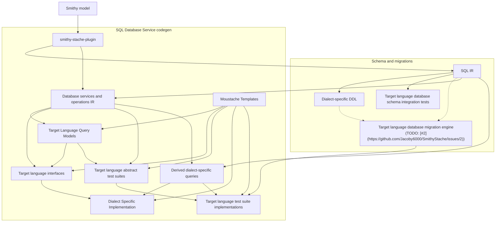

# Architecture

SmithyStache is an SBT multi-module project (**Scala 3.3.6**, strict compiler options) that publishes Smithy build plugins to Maven.

## Codegen pipeline

The Mermaid diagram below is generated from [`docs/reusable-components/architecture-pipeline.mmd`](../reusable-components/architecture-pipeline.mmd). Edit that component, then run `scripts/sync_reusable_components.py` to refresh embedded copies in this document and the repository [`README.md`](../../README.md).

The [`smithy-stache`](../../modules/smithy-stache-plugin/) plugin extracts **SQL IR** via [`SqlIrExtractor`](../../modules/smithy-sql-ir/src/main/scala/com/jacoby6000/smithy/stache/sql/SqlIrExtractor.scala) into [`SqlSchema`](../../modules/smithy-sql-ir/src/main/scala/com/jacoby6000/smithy/stache/sql/SqlSchemaModel.scala) (tables and relationships), then **service IR** via [`SqlServiceIrExtractor`](../../modules/smithy-sql-service-ir/src/main/scala/com/jacoby6000/smithy/stache/sql/SqlServiceIrExtractor.scala) into [`SqlServiceIr`](../../modules/smithy-sql-service-ir/src/main/scala/com/jacoby6000/smithy/stache/sql/SqlServiceIrModel.scala) (derived queries and `@sqlService` operations). SQL IR feeds the **schema and migrations** path directly. **SQL database service codegen** combines service IR with SQL IR, then renders target-language artifacts with Mustache templates.

<!-- architecture-pipeline.mmd:start -->

<!-- architecture-pipeline.mmd:end -->

### Pipeline stages

| Stage | Role today | Primary code / config |
|-------|------------|------------------------|
| Smithy model | Consumer or test Smithy IDL | `PluginContext.getModel` |
| `smithy-stache` plugin | Orchestrates extraction and rendering | [`SmithyStacheBuildPlugin`](../../modules/smithy-stache-plugin/src/main/scala/com/jacoby6000/smithy/stache/SmithyStacheBuildPlugin.scala) |
| SQL IR | `@sqlTable` structures and FK relationships | [`SqlIrExtractor`](../../modules/smithy-sql-ir/src/main/scala/com/jacoby6000/smithy/stache/sql/SqlIrExtractor.scala) |
| Database services and operations IR | Derived DML query specs and `@sqlService` operation contracts | [`SqlQueryExtractor`](../../modules/smithy-sql-service-ir/src/main/scala/com/jacoby6000/smithy/stache/sql/SqlQueryExtractor.scala), [`SqlServiceExtractor`](../../modules/smithy-sql-service-ir/src/main/scala/com/jacoby6000/smithy/stache/sql/SqlServiceExtractor.scala); `SqlServiceIr` |
| Mustache templates | Language- and dialect-specific codegen templates | `languageTargets.templateDirectory`; bundled `sql-service-codegen/` |
| Target Language Query Models | Dataclass (or equivalent) types for service input, output, error, and query shapes | [`SqlServiceCodegenRenderer`](../../modules/smithy-sql-service-renderer/src/main/scala/com/jacoby6000/smithy/stache/sql/codegen/SqlServiceCodegenRenderer.scala); `models.mustache` |
| Dialect-specific DDL | `CREATE TABLE`, indexes, enums, and a `-- Queries` section | [`DialectRenderer`](../../modules/smithy-sql-service-ir/src/main/scala/com/jacoby6000/smithy/stache/sql/DialectRenderer.scala); `smithy-stache.sql.<dialect>.migrationLocation` |
| Schema integration tests | Apply generated DDL to real databases | [`smithy-sql-postgres-renderer-it`](../../modules/smithy-sql-postgres-renderer-it/), [`smithy-sql-sqlite-renderer-it`](../../modules/smithy-sql-sqlite-renderer-it/) |
| Migration engine | Per-language migration runner with schema-hash tracking; planned input to generated test suites | Planned ([#2](https://github.com/Jacoby6000/SmithyStache/issues/2)) |
| Target language interfaces | Repository `Protocol` per `@sqlService` | `service_protocol.mustache`; service IR + query models + templates |
| Target language abstract test suites | Contract tests against the generated interface | `Protocol` defines the contract today; dedicated abstract test-suite templates are not yet bundled |
| Derived dialect-specific queries | INSERT, UPDATE, DELETE, and SELECT rendered per dialect from service IR, bound to service operations | `SqlServiceIr.queries`; service IR + SQL IR |
| Dialect-specific implementations | Driver-specific `@sqlService` implementations | `service_aiosqlite.mustache`, `service_psycopg.mustache`; interfaces + derived queries + templates |
| Test suite implementations | Pytest lifecycle tests for derived CRUD operations | `service_derived_sql_integration_tests*.mustache`; derived queries + abstract suites + templates (migration engine planned) |

Consumer configuration is documented in [Integration](../usage/integration.md): enabled dialects control DDL export and driver templates; `languageTargets` controls service codegen.

## Module graph

```
modules/smithy-stache-plugin (published)
    ├── smithy-sql-ir
    ├── smithy-sql-service-ir
    ├── smithy-sql-postgres-renderer
    ├── smithy-sql-sqlite-renderer
    └── smithy-sql-service-renderer

modules/smithy-stache-testkit (library)
    ├── smithy-sql-postgres-renderer-it (test)
    └── smithy-sql-sqlite-renderer-it (test)
```

- **smithy-sql-ir** — schema ADTs, table extraction, shared DDL primitives, `SqlParameterizedStatement`; Smithy trait IDL and Java `TraitService` SPI.
- **smithy-sql-service-ir** — query and service IR, `SqlQueryRenderer`, `DialectRenderer` trait.
- **smithy-sql-postgres-renderer** / **smithy-sql-sqlite-renderer** — dialect DDL and query sections.
- **smithy-sql-service-renderer** — Mustache codegen; Python-specific logic in `codegen.python`.
- **smithy-stache-plugin** — thin orchestration; only published Maven artifact (`com.jacoby6000:smithy-stache-plugin`).
- **smithy-stache-testkit** — shared Smithy fixtures and JDBC DDL helpers in `src/main`.
- **smithy-sql-postgres-renderer-it** / **smithy-sql-sqlite-renderer-it** — schema-path integration tests via [testcontainers-scala](https://github.com/testcontainers/testcontainers-scala/).

## SQL plugin design

### Validation

Model extraction and plugin settings validation use Cats **`ValidatedNel[SqlSchemaError, *]`** (`SqlValidated`) so errors accumulate across tables and members. [`SmithyStacheBuildPlugin`](../../modules/smithy-stache-plugin/src/main/scala/com/jacoby6000/smithy/stache/SmithyStacheBuildPlugin.scala) converts invalid results to a single exception at the Smithy build boundary. Do not use `for` on `Validated` (fail-fast); use `mapN` / `traverse`.

### Model extraction

[`SqlIrExtractor`](../../modules/smithy-sql-ir/src/main/scala/com/jacoby6000/smithy/stache/sql/SqlIrExtractor.scala) assembles **`SqlSchema`** (tables and relationships) from `@sqlTable` and `@sqlForeignKey` members (many-to-one by default; one-to-one when the FK column also has `@sqlUniqueIndex`). [`SqlServiceIrExtractor`](../../modules/smithy-sql-service-ir/src/main/scala/com/jacoby6000/smithy/stache/sql/SqlServiceIrExtractor.scala) assembles **`SqlServiceIr`**: [`SqlQueryExtractor`](../../modules/smithy-sql-service-ir/src/main/scala/com/jacoby6000/smithy/stache/sql/SqlQueryExtractor.scala) fills `queries` from derive traits; [`SqlServiceExtractor`](../../modules/smithy-sql-service-ir/src/main/scala/com/jacoby6000/smithy/stache/sql/SqlServiceExtractor.scala) validates `@sqlService` operation contracts into `services`. Derived queries bind to service methods by matching operation shape ids on derive traits.

### Rendering

**Schema and migrations:** dialect renderers expose structured **`SqlRenderUnit`** values (DDL statements or DML queries keyed by Smithy shape id). Postgres `CREATE TYPE` units use the enum shape id; table DDL uses the `@sqlTable` structure id. [`SqlRenderOutput.format`](../../modules/smithy-sql-ir/src/main/scala/com/jacoby6000/smithy/stache/sql/shared/SqlRenderOutput.scala) joins units into exported `.sql` migration file text so unit tests can assert one query or one DDL artifact without parsing the full output.

**SQL database service codegen:** [`SqlServiceCodegenRenderer`](../../modules/smithy-sql-service-renderer/src/main/scala/com/jacoby6000/smithy/stache/sql/codegen/SqlServiceCodegenRenderer.scala) combines service IR, SQL schema context, and Mustache templates into target-language query models, interfaces, dialect-specific implementations, and test suites. Enabled dialects select placeholder style and driver templates.

### Package layout

| Package | Responsibility |
|---------|----------------|
| `com.jacoby6000.smithy.stache` | `smithy-stache` build plugin (`SmithyStacheBuildPlugin`), settings validation |
| `com.jacoby6000.smithy.stache.sql` | `SqlValidated`, schema and service IR extraction, `DialectRenderer` trait |
| `com.jacoby6000.smithy.stache.sql.traits` | Java `TraitService` implementations (SPI-registered) |
| `com.jacoby6000.smithy.stache.sql.shared` | `DDLStatement`, DDL rendering, FK ordering, query rendering, `SqlRenderOutput` |
| `com.jacoby6000.smithy.stache.sql.sqlite` | SQLite column types and `CHECK` constraints |
| `com.jacoby6000.smithy.stache.sql.postgres` | Postgres column types |
| `com.jacoby6000.smithy.stache.sql.codegen` | Mustache orchestration for `@sqlService` codegen |
| `com.jacoby6000.smithy.stache.sql.codegen.python` | Python type names, bind/read expressions, template attributes |

## Dependencies

| Library | Version | Used for |
|---------|---------|----------|
| Smithy (`smithy-build`, `smithy-model`, `smithy-utils`) | 1.71.0 | Build plugins and trait model |
| Cats Core | 2.12.0 | `ValidatedNel` validation |
| Cats Effect | 3.7.0 | Available on all modules |
| Scalate | 1.10.1 | `sql-service-codegen` Mustache templates |

Synchronous extraction does not use `IO`.

## Toolchain

- **sbtn** — always use the SBT thin client from this repository; never plain `sbt` or `coursier launch org.scala-sbt:sbt-launch:…`.
- **Smithy models** — Smithy 2.0 IDL (`$version: "2.0"`).
- **Python renderer tests** — ephemeral uv workspace under `modules/smithy-sql-service-renderer/target/sql-service-codegen-python-workspace/`; requires `uv` on `PATH`.
