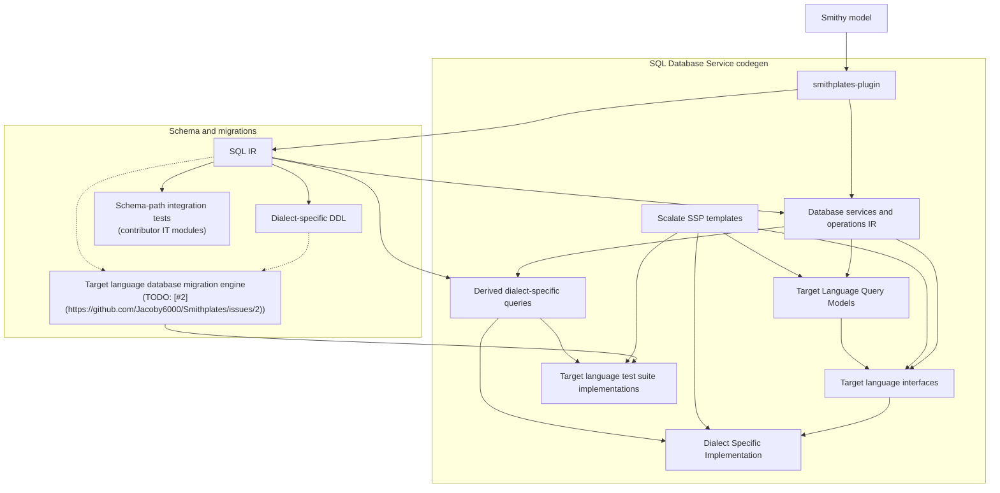

# Architecture

Smithplates is an SBT multi-module project (**Scala 3.3.6**, strict compiler options) that publishes Smithy build plugins to Maven.

## Codegen pipeline

The Mermaid diagram below is generated from [`docs/reusable-components/architecture-pipeline.mmd`](../reusable-components/architecture-pipeline.mmd). Edit that component, then run `scripts/sync_reusable_components.py` to refresh embedded copies in this document and the repository [`README.md`](../../README.md).

The [`smithplates`](../../modules/smithplates-plugin/) plugin extracts **SQL IR** via [`SqlIrExtractor`](../../modules/smithplates-sql-ir/src/main/scala/com/jacoby6000/smithplates/sql/SqlIrExtractor.scala) into [`SqlSchema`](../../modules/smithplates-sql-ir/src/main/scala/com/jacoby6000/smithplates/sql/model/SqlSchemaModel.scala) (tables and relationships), then **service IR** via [`SqlServiceIrExtractor`](../../modules/smithplates-sql-service-ir/src/main/scala/com/jacoby6000/smithplates/sql/service/SqlServiceIrExtractor.scala) into [`SqlServiceIr`](../../modules/smithplates-sql-service-ir/src/main/scala/com/jacoby6000/smithplates/sql/service/SqlServiceIrModel.scala) (derived queries and `@sqlService` operations). SQL IR feeds the **schema and migrations** path directly. **SQL database service codegen** combines service IR with SQL IR, then renders target-language artifacts with Scalate SSP templates.

<!-- architecture-pipeline.mmd:start -->

<!-- architecture-pipeline.mmd:end -->

### Pipeline stages

| Stage | Role today | Primary code / config |
|-------|------------|------------------------|
| Smithy model | Consumer or test Smithy IDL | `PluginContext.getModel` |
| `smithplates` plugin | Orchestrates extraction and rendering | [`SmithplatesBuildPlugin`](../../modules/smithplates-plugin/src/main/scala/com/jacoby6000/smithplates/plugin/SmithplatesBuildPlugin.scala) |
| SQL IR | `@sqlTable` structures and FK relationships | [`SqlIrExtractor`](../../modules/smithplates-sql-ir/src/main/scala/com/jacoby6000/smithplates/sql/SqlIrExtractor.scala) |
| Database services and operations IR | Derived DML query specs and `@sqlService` operation contracts | [`SqlQueryExtractor`](../../modules/smithplates-sql-service-ir/src/main/scala/com/jacoby6000/smithplates/sql/service/SqlQueryExtractor.scala), [`SqlServiceExtractor`](../../modules/smithplates-sql-service-ir/src/main/scala/com/jacoby6000/smithplates/sql/service/SqlServiceExtractor.scala); `SqlServiceIr` |
| SSP templates | Language- and dialect-specific codegen templates | `languageTargets.templateDirectory`; bundled sources under [`templates/`](../../templates/) |
| Target Language Query Models | Dataclass (or equivalent) types for service input, output, error, and query shapes | [`SqlServiceCodegenRenderer`](../../modules/smithplates-sql-service-renderer/src/main/scala/com/jacoby6000/smithplates/sql/service/renderer/SqlServiceCodegenRenderer.scala); `models.ssp` |
| Dialect-specific DDL | `CREATE TABLE`, indexes, enums, and a `-- Queries` section | [`SqlSchemaDdlRenderer`](../../modules/smithplates-sql-ddl-renderer-common/src/main/scala/com/jacoby6000/smithplates/sql/ddl/renderer/common/SqlSchemaDdlRenderer.scala) per dialect; [`DialectRenderers.render`](../../modules/smithplates-plugin/src/main/scala/com/jacoby6000/smithplates/plugin/DialectRenderers.scala) composes DDL + query units in the plugin; `smithplates.sql.<dialect>.migrationLocation` |
| Schema integration tests | Apply generated DDL to real databases | [`smithplates-sql-ddl-renderer-postgres-it`](../../modules/smithplates-sql-ddl-renderer-postgres-it/), [`smithplates-sql-ddl-renderer-sqlite-it`](../../modules/smithplates-sql-ddl-renderer-sqlite-it/) |
| Migration engine | Per-language migration runner with schema-hash tracking; planned input to generated test suites | Planned ([#2](https://github.com/Jacoby6000/Smithplates/issues/2)) |
| Target language interfaces | Repository `Protocol` per `@sqlService` | `service_protocol.ssp`; service IR + query models + templates |
| Derived dialect-specific queries | INSERT, UPDATE, DELETE, and SELECT rendered per dialect from service IR, bound to service operations | `SqlServiceIr.queries`; service IR + SQL IR |
| Dialect-specific implementations | Driver-specific `@sqlService` implementations | `service_aiosqlite.ssp`, `service_psycopg.ssp`; interfaces + derived queries + templates |
| Test suite implementations | Pytest lifecycle tests for derived CRUD operations | `service_derived_sql_integration_tests*.ssp`; derived queries + templates (migration engine planned) |

Consumer configuration is documented in [Integration](../usage/integration.md): enabled dialects control DDL export and driver templates; `languageTargets` controls service codegen.

## Module graph

```
modules/smithplates-plugin (published)
    ├── smithplates-sql-ir
    ├── smithplates-sql-ddl-renderer-common
    ├── smithplates-sql-service-ir
    ├── smithplates-sql-ddl-renderer-postgres
    ├── smithplates-sql-ddl-renderer-sqlite
    ├── smithplates-sql-service-query-renderer
    ├── smithplates-sql-service-query-renderer-common
    ├── smithplates-sql-service-query-renderer-postgres
    ├── smithplates-sql-service-query-renderer-sqlite
    └── smithplates-sql-service-renderer

modules/smithplates-testkit (library)
    ├── smithplates-sql-ddl-renderer-postgres-it (test)
    └── smithplates-sql-ddl-renderer-sqlite-it (test)
```

- **smithplates-sql-ir** — schema ADTs, table extraction; Smithy trait IDL and Java `TraitService` SPI.
- **smithplates-sql-ddl-renderer-common** — shared DDL rendering (`SqlSchemaDdlRenderer`, `SqlShared`).
- **smithplates-sql-service-ir** — query and service IR, extractors.
- **smithplates-sql-service-query-renderer** — `SqlQueryRenderer` trait, `SqlParameterizedStatement`, dialect-neutral query output types.
- **smithplates-sql-service-query-renderer-common** — shared dialect-neutral query rendering (`SqlQueryRendering`).
- **smithplates-sql-service-query-renderer-postgres** / **smithplates-sql-service-query-renderer-sqlite** — dialect `SqlQueryRenderer` implementations.
- **smithplates-sql-ddl-renderer-sqlite** / **smithplates-sql-ddl-renderer-postgres** — dialect schema DDL (`SqlSchemaDdlRenderer`); depend on `smithplates-sql-ddl-renderer-common`; no service-IR dependency.
- **smithplates-sql-service-renderer** — Scalate SSP service codegen; compile depends on query-renderer base only.
- **smithplates-plugin** — thin orchestration; only published Maven artifact (`com.jacoby6000:smithplates-plugin`).
- **smithplates-testkit** — shared Smithy fixtures and JDBC DDL helpers in `src/main`.
- **smithplates-sql-ddl-renderer-postgres-it** / **smithplates-sql-ddl-renderer-sqlite-it** — schema-path integration tests via [testcontainers-scala](https://github.com/testcontainers/testcontainers-scala/).

## SQL plugin design

### Validation

Model extraction and plugin settings validation use Cats **`ValidatedNel[SqlSchemaError, *]`** (`SqlValidated`) so errors accumulate across tables and members. [`SmithplatesBuildPlugin`](../../modules/smithplates-plugin/src/main/scala/com/jacoby6000/smithplates/plugin/SmithplatesBuildPlugin.scala) converts invalid results to a single exception at the Smithy build boundary. Do not use `for` on `Validated` (fail-fast); use `mapN` / `traverse`.

### Model extraction

[`SqlIrExtractor`](../../modules/smithplates-sql-ir/src/main/scala/com/jacoby6000/smithplates/sql/SqlIrExtractor.scala) assembles **`SqlSchema`** (tables and relationships) from `@sqlTable` and `@sqlForeignKey` members (many-to-one by default; one-to-one when the FK column also has `@sqlUniqueIndex`). [`SqlServiceIrExtractor`](../../modules/smithplates-sql-service-ir/src/main/scala/com/jacoby6000/smithplates/sql/service/SqlServiceIrExtractor.scala) assembles **`SqlServiceIr`**: [`SqlQueryExtractor`](../../modules/smithplates-sql-service-ir/src/main/scala/com/jacoby6000/smithplates/sql/service/SqlQueryExtractor.scala) fills `queries` from derive traits; [`SqlServiceExtractor`](../../modules/smithplates-sql-service-ir/src/main/scala/com/jacoby6000/smithplates/sql/service/SqlServiceExtractor.scala) validates `@sqlService` operation contracts into `services`. Derived queries bind to service methods by matching operation shape ids on derive traits.

### Rendering

**Schema and migrations:** dialect DDL renderers expose [`DDLStatement`](../../modules/smithplates-sql-ir/src/main/scala/com/jacoby6000/smithplates/sql/model/DDLStatement.scala) values keyed by Smithy shape id; dialect query renderers expose [`SqlRenderedQuery`](../../modules/smithplates-sql-service-query-renderer/src/main/scala/com/jacoby6000/smithplates/sql/service/query/renderer/SqlRenderedQuery.scala). [`DialectRenderers.render`](../../modules/smithplates-plugin/src/main/scala/com/jacoby6000/smithplates/plugin/DialectRenderers.scala) composes DDL and query sections into exported `.sql` migration file text.

**SQL database service codegen:** [`SqlServiceCodegenRenderer`](../../modules/smithplates-sql-service-renderer/src/main/scala/com/jacoby6000/smithplates/sql/service/renderer/SqlServiceCodegenRenderer.scala) combines service IR, SQL schema context, injected [`SqlQueryRenderer`](../../modules/smithplates-sql-service-query-renderer/src/main/scala/com/jacoby6000/smithplates/sql/service/query/renderer/SqlQueryRenderer.scala) instances, and Scalate SSP templates into target-language query models, interfaces, dialect-specific implementations, and test suites. Enabled dialect keys select placeholder style and driver templates.

### Package layout

| Package | Responsibility |
|---------|----------------|
| `com.jacoby6000.smithplates.plugin` | `smithplates` build plugin (`SmithplatesBuildPlugin`), settings validation |
| `com.jacoby6000.smithplates.sql` | `SqlValidated`, schema IR extraction, table traits |
| `com.jacoby6000.smithplates.sql.traits` | Schema trait `TraitService` implementations (`smithplates-sql-ir`, SPI-registered) |
| `com.jacoby6000.smithplates.sql.service` | Service/query IR, extractors |
| `com.jacoby6000.smithplates.sql.service.traits` | Query/service trait `TraitService` implementations (`smithplates-sql-service-ir`, SPI-registered) |
| `com.jacoby6000.smithplates.sql.service.query.renderer` | `SqlQueryRenderer`, `SqlParameterizedStatement`, `SqlRenderedQuery`, `SqlQueryRenderOutput` |
| `com.jacoby6000.smithplates.sql.service.query.renderer.common` | `SqlQueryRendering` (dialect-neutral query unit rendering) |
| `com.jacoby6000.smithplates.sql.service.query.renderer.postgres` / `.sqlite` | Dialect `SqlQueryRenderer` implementations |
| `com.jacoby6000.smithplates.sql.ddl.renderer.common` | `SqlSchemaDdlRenderer`, `SqlShared`, DDL rendering (`smithplates-sql-ddl-renderer-common`) |
| `com.jacoby6000.smithplates.sql.ddl.renderer.sqlite` | SQLite column types and `CHECK` constraints |
| `com.jacoby6000.smithplates.sql.ddl.renderer.postgres` | Postgres column types |
| `com.jacoby6000.smithplates.sql.service.codegen` | Resolved operation queries (`SqlOperationQueryResolver`, `smithplates-sql-service-ir`) |
| `com.jacoby6000.smithplates.sql.service.renderer` | Scalate SSP orchestration for `@sqlService` codegen (`smithplates-sql-service-renderer`) |
| `com.jacoby6000.smithplates.sql.service.renderer.codegentest` | Shared golden-template test infrastructure (`smithplates-sql-service-renderer` tests) |
| `com.jacoby6000.smithplates.plugin.codegentest` | Plugin-local golden-template runner helpers (`smithplates-plugin` tests) |

## Dependencies

| Library | Version | Used for |
|---------|---------|----------|
| Smithy (`smithy-build`, `smithy-model`, `smithy-utils`) | 1.71.0 | Build plugins and trait model |
| Cats Core | 2.12.0 | `ValidatedNel` validation |
| Cats Effect | 3.7.0 | Declared on `smithplatesPlugin`, `smithplatesTestkit`, dialect IT modules, and root; extraction does not use `IO` |
| Scalate | 1.10.1 | SSP templates under [`templates/`](../../templates/) |

Synchronous extraction does not use `IO`.

## Toolchain

- **sbtn** — always use the SBT thin client from this repository; never plain `sbt` or `coursier launch org.scala-sbt:sbt-launch:…`.
- **Smithy models** — Smithy 2.0 IDL (`$version: "2.0"`).
- **Python language test harness** — [`language-test-harnesses/python/`](../../language-test-harnesses/python/) runs ruff, mypy, and pytest against `templates/python/tests/<case>/expected/` in place; requires `uv` on `PATH` (Docker for postgres variants).
